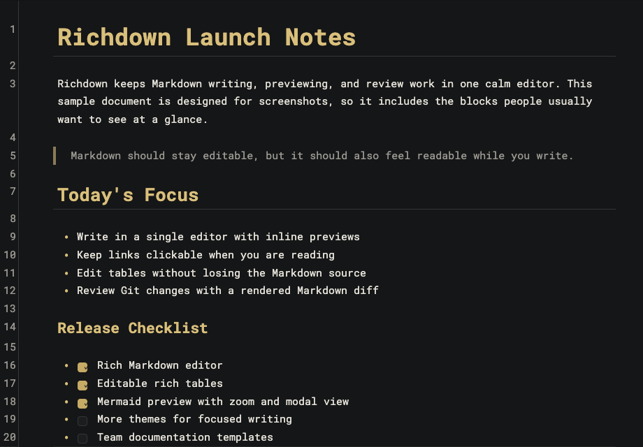
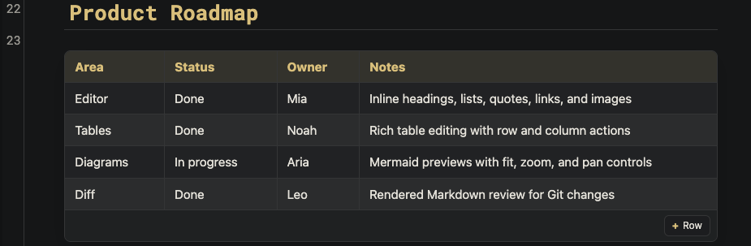
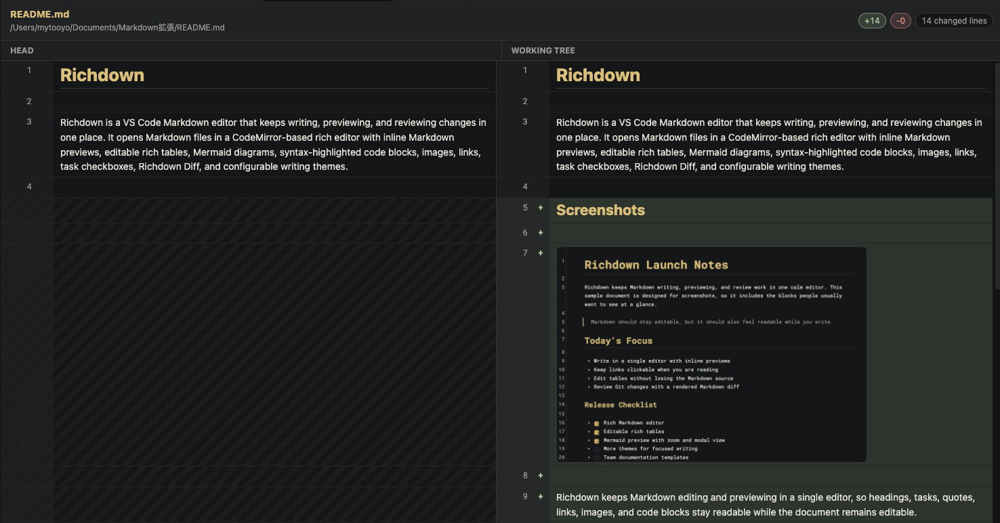

# Richdown

Richdown is a VS Code Markdown editor that keeps writing, previewing, reviewing, and exporting changes in one place. It opens Markdown files in a CodeMirror-based rich editor with inline Markdown previews, editable rich tables, colored Mermaid diagrams, Gherkin BDD boards, syntax-highlighted code blocks, inline color swatches, images, links, task checkboxes, Git change markers, HTML/PDF export, Richdown Diff, and configurable writing themes.

## Screenshots



Richdown keeps Markdown editing and previewing in a single editor, so headings, tasks, quotes, links, images, and code blocks stay readable while the document remains editable.



Tables become editable rich UI, and Mermaid diagrams render inline with controls for fitting, zooming, panning, and modal viewing.



Richdown Diff gives Markdown changes a rendered side-by-side review view while keeping VS Code's native diff viewer available.

## Features

- Opens regular `.md` and `.markdown` files with the Richdown editor by default while keeping Source Control diffs in VS Code's native diff viewer.
- Automatically refreshes an open Richdown editor when an AI agent or another external tool changes the Markdown file on disk.
- Toggle between Richdown and the standard VS Code text editor from the editor title button or the command palette.
- Open the VS Code Git diff for the current Markdown file from the editor title button or the command palette.
- Open a Richdown Diff view for Markdown changes, including rendered headings, lists, tables, images, links, and highlighted code blocks.
- Export local Markdown files to Richdown-styled HTML or PDF from the editor title button or the command palette.
- Preview headings, emphasis, inline code, links, images, blockquotes, task checkboxes, thematic breaks, code blocks, tables, details blocks, Mermaid diagrams, and Gherkin scenarios while editing.
- Show a color swatch after inline code color values such as `#ff0066`, and mark added, changed, and deleted Git lines beside the line numbers.
- Highlight matches for the active Richdown search query using VS Code find-match colors.
- Edit Markdown tables as rich tables, including cell editing, row/column insertion, and row/column deletion.
- Render Mermaid diagrams lazily with optional Richdown colorization, fit, zoom, pan, and modal viewing controls. Richdown supports both Markdown fences and Azure DevOps-style `::: mermaid` blocks.
- Render `gherkin`, `feature`, and `cucumber` fenced code blocks as switchable BDD boards with highlighted source view.
- Choose the preview width and theme from the in-editor settings button.
- Switch between the default VS Code theme and several built-in dark/light themes.

## Commands

- `Richdown: Toggle Markdown Open Mode`: Switch whether Markdown files open with Richdown or the standard VS Code text editor.
- `Richdown: Open Rich Diff`: Open a Richdown-rendered Markdown diff against `HEAD`.
- `Richdown: Open Git Diff`: Open the VS Code Git diff for the current Markdown file.
- `Richdown: Export HTML`: Export the current local Markdown file as a standalone Richdown preview. The HTML uses the same rich table, Mermaid, Gherkin, image, task, code, and theme UI as the editor.
- `Richdown: Export PDF`: Export the current local Markdown file by printing the standalone Richdown preview through an installed Chromium-based browser.

## Settings

- `richdown.openMarkdownAsRichEditor`: Open regular local Markdown files with Richdown by default while keeping Source Control diffs in VS Code's native diff editor.
- `richdown.richTheme`: Select the Richdown editor theme. `default` follows the active VS Code theme.
- `richdown.richTablePreview`: Render Markdown tables as editable rich tables.
- `richdown.mermaidPreview`: Render Mermaid code blocks as diagrams.
- `richdown.mermaidColorized`: Apply Richdown's clearer color palette to Mermaid diagrams.
- `richdown.mermaidPreviewSize`: Choose the Mermaid preview height behavior.
- `richdown.gherkinPreview`: Render Gherkin code blocks as BDD boards.
- `richdown.previewWidth`: Choose the Richdown content width.

## Development

Install dependencies and build the bundled webview assets:

```bash
npm install
npm run build:all
```

Run the extension locally:

1. Open this folder in VS Code.
2. Press `F5` to start the Extension Development Host.
3. Open a Markdown file in the new VS Code window.

Package a VSIX:

```bash
npm run build:all
npx @vscode/vsce package
```

## Cursor and Open VSX

Cursor and several other VS Code-compatible editors use Open VSX instead of the Visual Studio Marketplace. If Richdown does not appear in Cursor search, install the generated VSIX manually or publish the extension to Open VSX as well.

Install locally from VSIX:

1. Run `npm run package:vsix`.
2. In Cursor, open the command palette.
3. Run `Extensions: Install from VSIX...`.
4. Select `richdown-0.7.4.vsix`.

Publish to Open VSX:

```bash
npx ovsx create-namespace mytooyodev -p <open-vsx-token>
npm run publish:openvsx -- -p <open-vsx-token>
```

## GitHub Actions Deployment

The `Deploy Extension` workflow packages one VSIX and can publish it to both the Visual Studio Marketplace and Open VSX. It runs automatically when changes are merged into `main`, and it can also be run manually.

Configure these repository secrets in GitHub:

- `VSCE_PAT`: Visual Studio Marketplace personal access token.
- `OVSX_PAT`: Open VSX personal access token.

Deploy manually:

1. Open the repository on GitHub.
2. Go to `Actions` -> `Deploy Extension`.
3. Run the workflow and choose whether to publish to Marketplace, Open VSX, or both.

Deploy from `main`:

1. Update `package.json` and `CHANGELOG.md`.
2. Merge the change into `main`.
3. The workflow publishes to both registries.

## Release Notes

Release notes are tracked in the root `CHANGELOG.md` file.
