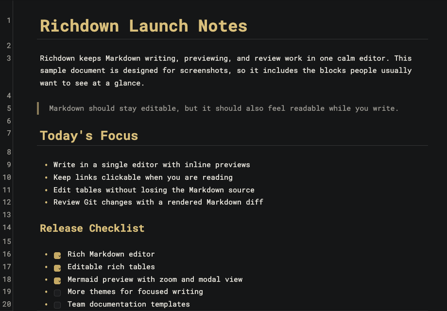
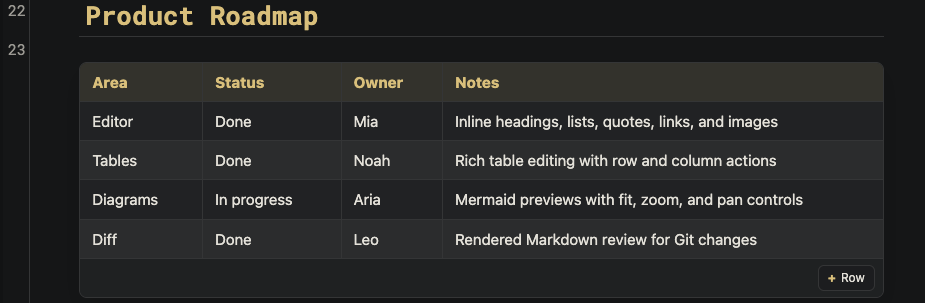
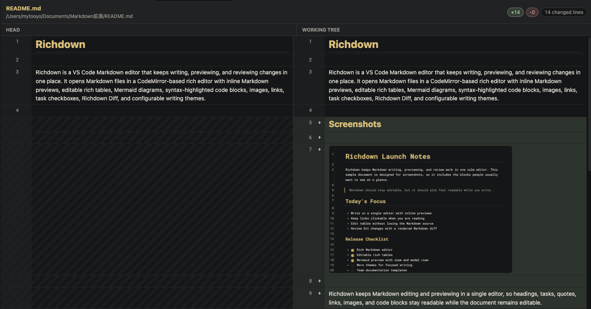

# Richdown

Richdown is a VS Code Markdown editor that keeps writing, previewing, reviewing, and exporting changes in one place. It opens Markdown files in a CodeMirror-based rich editor with inline Markdown previews, editable rich tables, colored Mermaid diagrams, Gherkin BDD boards, syntax-highlighted code blocks, inline color swatches, images, links, task checkboxes, Git change markers, HTML/PDF export, Richdown Diff, and configurable writing themes.

## Screenshots



Richdown keeps Markdown editing and previewing in a single editor, so headings, tasks, quotes, links, images, and code blocks stay readable while the document remains editable.



Tables become editable rich UI, and Mermaid diagrams render inline with controls for fitting, zooming, panning, and modal viewing.



Richdown Diff gives Markdown changes a rendered side-by-side review view while keeping VS Code's native diff viewer available.

## Features

- Opens regular `.md` and `.markdown` files with the Richdown editor by default while keeping Source Control diffs in VS Code's native diff viewer.
- Automatically refreshes an open Richdown editor when an AI agent or another external tool changes the Markdown file on disk.
- Follows `#heading` and `#L12` links between Markdown files to the target heading or line.
- Opens Markdown file links from AI extensions such as Claude Code and Codex in Richdown at the linked line, with the match highlighted. These extensions open files in the text editor, which Richdown takes over with the position.
- Optionally does the same for VS Code Search results and Copilot Chat links (`richdown.jumpToOpenedPosition`, off by default). VS Code passes that position only to text editors, so this opens every Markdown file in the text editor first and switches to Richdown right away, with a visible flicker.
- Shows a banner when GitHub Copilot has pending edits to the open file, with Keep and Undo buttons and a Review Changes button that opens Copilot's inline diff in the text editor. Richdown takes the file back once every edit is kept or undone.
- Toggle between Richdown and the standard VS Code text editor from the editor title button or the command palette.
- Open the VS Code Git diff for the current Markdown file from the editor title button or the command palette.
- Open a Richdown Diff view for Markdown changes, including rendered headings, lists, tables, images, links, and highlighted code blocks.
- Export local Markdown files to Richdown-styled HTML or PDF from the editor title button or the command palette.
- Preview headings, emphasis, inline code, links, images, blockquotes, task checkboxes, thematic breaks, code blocks, tables, details blocks, Mermaid diagrams, and Gherkin scenarios while editing.
- Render YAML front matter (`---` fenced headers) as a clean metadata card with keys, values, and tag chips; click the card to edit the YAML source.
- Suggest completions while typing, matching the standard VS Code editor: VS Code's registered completion providers (including ones from other extensions, such as model names in agent files), plus code fence language ids.
- Show a color swatch after inline code color values such as `#ff0066`, and mark added, changed, and deleted Git lines beside the line numbers.
- Highlight matches for the active Richdown search query using VS Code find-match colors.
- Edit Markdown tables as rich tables, including cell editing, row/column insertion, and row/column deletion. `<br>` inside a cell renders as a line break.
- Render Mermaid diagrams lazily with optional Richdown colorization, fit, zoom, pan, and modal viewing controls. Richdown supports both Markdown fences and Azure DevOps-style `::: mermaid` blocks.
- Render `gherkin`, `feature`, and `cucumber` fenced code blocks as switchable BDD boards with highlighted source view.
- Format Markdown with configurable rules — heading style, list markers and numbering, aligned tables (East Asian wide characters count as two columns), blank lines around blocks, and whitespace — from the command palette, `Shift+Alt+F`, or on save.
- Check Markdown with lint rules and show the problems in the Problems panel and as squiggles with hover messages in the Richdown editor. Each formatter and lint rule can be turned on or off in a `.richdownrc.json` file.
- Choose the preview width and theme from the in-editor settings button.
- Switch between the default VS Code theme and several built-in dark/light themes.

## Commands

- `Richdown: Toggle Markdown Open Mode`: Switch whether Markdown files open with Richdown or the standard VS Code text editor.
- `Richdown: Open Rich Diff`: Open a Richdown-rendered Markdown diff against `HEAD`.
- `Richdown: Open Git Diff`: Open the VS Code Git diff for the current Markdown file.
- `Richdown: Export HTML`: Export the current local Markdown file as a standalone Richdown preview. The HTML uses the same rich table, Mermaid, Gherkin, image, task, code, and theme UI as the editor.
- `Richdown: Export PDF`: Export the current local Markdown file by printing the standalone Richdown preview through an installed Chromium-based browser.
- `Richdown: Format Document`: Format the current Markdown file with the rules enabled in `.richdownrc.json`. `Shift+Alt+F` runs it in the Richdown editor; in the text editor, VS Code's own Format Document uses Richdown when it is chosen as the Markdown formatter.
- `Richdown: Create Formatter and Lint Configuration`: Create a `.richdownrc.json` in the workspace folder that lists every rule at its default, with a description of each, and open it.

## Settings

- `richdown.openMarkdownAsRichEditor`: Open regular local Markdown files with Richdown by default while keeping Source Control diffs in VS Code's native diff editor.
- `richdown.richTheme`: Select the Richdown editor theme. `default` follows the active VS Code theme.
- `richdown.richTablePreview`: Render Markdown tables as editable rich tables.
- `richdown.mermaidPreview`: Render Mermaid code blocks as diagrams.
- `richdown.mermaidColorized`: Apply Richdown's clearer color palette to Mermaid diagrams.
- `richdown.mermaidPreviewSize`: Choose the Mermaid preview height behavior.
- `richdown.gherkinPreview`: Render Gherkin code blocks as BDD boards.
- `richdown.previewWidth`: Choose the Richdown content width.
- `richdown.lint.enabled`: Check Markdown files and report problems (on by default).
- `richdown.formatOnSave`: Format Markdown files when they are saved (off by default). Auto save after a delay does not format.

## Formatter and Lint

Rules are turned on or off in a `.richdownrc.json` file. Richdown uses the nearest one found by walking up from the Markdown file to its workspace folder; without one, every rule uses its default. The file is JSON with comments, and VS Code completes and validates rule names in it. Run `Richdown: Create Formatter and Lint Configuration` to start from a file that lists every rule.

```jsonc
{
  "format": {
    "rules": {
      "table-format": false,              // turn a rule off
      "list-marker": { "style": "*" }     // turn a rule on with options
    }
  },
  "lint": {
    "rules": {
      "no-hard-tabs": false,              // turn a rule off
      "heading-increment": "error",       // turn a rule on with a severity: error, warning, info, hint
      "line-length": { "severity": "info", "max": 100 }
    }
  }
}
```

- A rule's value is `true`/`false`, an options object (`{ "enabled": false }` also turns it off), or, for lint rules, a severity.
- `"default": false` (or `true`) next to `"rules"` turns every rule that is not listed off (or on), so you can opt in to a few rules only.
- `"format": false` or `"lint": false` turns the formatter or the linter off for every file under that configuration.
- Lint rules can be silenced inside a document with `<!-- richdown-lint-disable-next-line rule-name -->`, or for a range with `<!-- richdown-lint-disable rule-name -->` … `<!-- richdown-lint-enable rule-name -->`. Without rule names, the comment applies to every rule.

The formatter never changes fenced code, front matter, HTML blocks, or block quotes, and leaves a construct alone when rewriting it would change how it renders.

| Formatter rule | Default | What it does |
| --- | --- | --- |
| `heading-style` | on | Converts single-line setext headings (`===` / `---` underlines) to `#` headings. |
| `atx-heading` | on | One space after the `#` marks, no indentation or closing `#` marks; adds the missing space to a stand-alone `##Heading` line. |
| `list-marker` | on (`"-"`) | Uses one bullet marker: `"-"`, `"*"`, `"+"`, or `"consistent"` (the document's first one). |
| `ordered-list-numbering` | on (`"ordered"`) | Numbers ordered lists 1, 2, 3 from the first item's number; lists that repeat one number are kept. `"one"` numbers every item 1. |
| `thematic-break` | on | Writes horizontal rules as `---`. |
| `table-format` | on | Aligns table columns and pads short rows. |
| `blank-lines-around-headings` | on | Blank line before and after headings. |
| `blank-lines-around-fences` | on | Blank line before and after fenced code blocks. |
| `blank-lines-around-lists` | on | Blank line before and after lists. |
| `blank-lines-around-tables` | on | Blank line before and after tables. |
| `trailing-whitespace` | on | Removes trailing whitespace, keeping two-space hard line breaks. |
| `consecutive-blank-lines` | on | Collapses repeated blank lines and removes leading ones. |
| `final-newline` | on | Ends the file with exactly one newline. |

| Lint rule | Default | What it reports |
| --- | --- | --- |
| `heading-increment` | warning | Heading levels that skip a level. |
| `single-h1` | warning | More than one top-level `#` heading. |
| `no-duplicate-heading` | warning | Sibling headings with the same text. |
| `no-empty-heading` | warning | Headings without text. |
| `heading-space` | warning | Missing or extra spaces after the `#` marks. |
| `blanks-around-headings` | warning | Headings without surrounding blank lines. |
| `blanks-around-fences` | warning | Fenced code blocks without surrounding blank lines. |
| `blanks-around-lists` | warning | Lists without surrounding blank lines. |
| `blanks-around-tables` | warning | Tables without surrounding blank lines. |
| `fenced-code-language` | warning | Fenced code blocks without a language. |
| `unclosed-code-fence` | error | Code fences that are never closed. |
| `list-marker-style` | warning | Bullet markers that differ from the first one, or from `"style"`. |
| `ordered-list-numbering` | warning | Ordered list numbers out of sequence. |
| `table-column-count` | warning | Table rows with a different cell count than the header. |
| `no-empty-links` | warning | Links without a destination. |
| `no-reversed-links` | warning | `(text)[url]` instead of `[text](url)`. |
| `no-missing-image-alt` | info | Images without alternate text. |
| `no-broken-anchors` | warning | `#anchor` links that match no heading in the document. |
| `no-trailing-spaces` | warning | Trailing whitespace other than a two-space hard break. |
| `no-hard-tabs` | warning | Tab characters outside code blocks. |
| `no-multiple-blanks` | warning | More than one consecutive blank line. |
| `final-newline` | warning | A missing final newline, or trailing blank lines. |
| `no-bare-urls` | off | URLs not written as links or `<url>`. |
| `line-length` | off (`"max": 120`) | Lines longer than `max` columns outside code and tables. |

## Development

Install dependencies and build the bundled webview assets:

```bash
npm install
npm run build:all
```

Run the extension locally:

1. Open this folder in VS Code.
2. Press `F5` to start the Extension Development Host.
3. Open a Markdown file in the new VS Code window.

Run the tests:

```bash
npm test                          # run once
npm run test:watch                # re-run on change
npm run test:coverage             # coverage report for src/
npm test -- test/diffRows.test.js # a single suite
```

The suites live in [test/](test/) and run on [Vitest](https://vitest.dev). They import the
real modules from `src/`, so they exercise the code that ships in `media/`. Pure logic runs
in the default Node environment; DOM-facing modules opt into jsdom with a
`// @vitest-environment jsdom` docblock at the top of the file.

- [test/helpers/testKit.js](test/helpers/testKit.js) holds the CodeMirror `Text` and
  selection stand-ins used by the domain tests.
- [test/helpers/previewHarness.js](test/helpers/previewHarness.js) builds a real
  `EditorView` with the full preview extension set, so table, Mermaid, Gherkin,
  front matter and details previews are tested through the decorations the editor
  actually produces.
- [test/webviewBootstrap.test.js](test/webviewBootstrap.test.js) boots
  `src/richEditor.js` and `src/richDiff.js` against a stand-in VS Code host.

`npm run test:coverage` enforces coverage thresholds from
[vitest.config.js](vitest.config.js). The largest deliberate gap is the PDF export's
Chrome DevTools plumbing in [src/export/markdownExport.js](src/export/markdownExport.js),
which needs a real browser; its launch and failure handling are covered with a stand-in
executable in [test/pdfExport.test.js](test/pdfExport.test.js).

Static analysis:

```bash
npm run lint       # ESLint over extension.js, src/ and test/
npm run lint:fix   # apply the fixable findings
```

Rules live in [eslint.config.mjs](eslint.config.mjs), which applies node globals to the
extension host files and browser globals to the webview files. Generated bundles under
`media/` are never linted.

### Pull request quality gate

[.github/workflows/ci.yml](.github/workflows/ci.yml) runs on every pull request and on
pushes to `main`:

| Job | Command | What it protects |
| --- | --- | --- |
| Lint | `npm run lint` | ESLint findings across the extension host, webview and tests |
| Test | `npm run test:coverage` | Vitest suites plus the coverage thresholds |
| Bundles | `npm run verify:bundles` | The committed `media/*.js` still match `src/` |
| Package VSIX | `npm run package:vsix` | The extension still packages, with the VSIX kept as an artifact |

Run the same gate locally before opening a pull request:

```bash
npm run lint && npm run test:coverage && npm run verify:bundles
```

`media/*.js` is committed and is what VS Code loads, so
[scripts/verify-bundles.mjs](scripts/verify-bundles.mjs) rebuilds each bundle in memory
and compares it with the committed file. If it fails, run `npm run build:all` and commit
the result.

Package a VSIX:

```bash
npm run build:all
npx @vscode/vsce package
```

## Cursor and Open VSX

Cursor and several other VS Code-compatible editors use Open VSX instead of the Visual Studio Marketplace. If Richdown does not appear in Cursor search, install the generated VSIX manually or publish the extension to Open VSX as well.

Install locally from VSIX:

1. Run `npm run package:vsix`.
2. In Cursor, open the command palette.
3. Run `Extensions: Install from VSIX...`.
4. Select `richdown-0.7.4.vsix`.

Publish to Open VSX:

```bash
npx ovsx create-namespace mytooyodev -p <open-vsx-token>
npm run publish:openvsx -- -p <open-vsx-token>
```

## GitHub Actions Deployment

The `Deploy Extension` workflow packages one VSIX and can publish it to both the Visual Studio Marketplace and Open VSX. It runs automatically when changes are merged into `main`, and it can also be run manually.

Configure these repository secrets in GitHub:

- `VSCE_PAT`: Visual Studio Marketplace personal access token.
- `OVSX_PAT`: Open VSX personal access token.

Deploy manually:

1. Open the repository on GitHub.
2. Go to `Actions` -> `Deploy Extension`.
3. Run the workflow and choose whether to publish to Marketplace, Open VSX, or both.

Deploy from `main`:

1. Update `package.json` and `CHANGELOG.md`.
2. Merge the change into `main`.
3. The workflow publishes to both registries.

## Release Notes

Release notes are tracked in the root `CHANGELOG.md` file.
